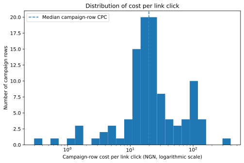
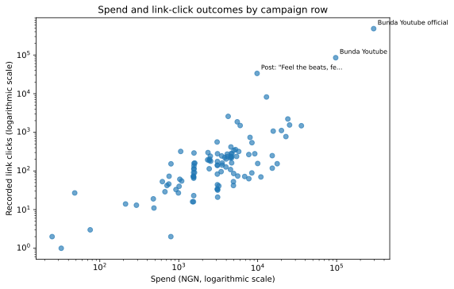
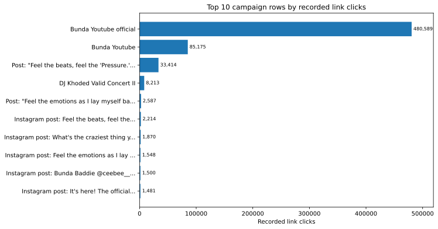
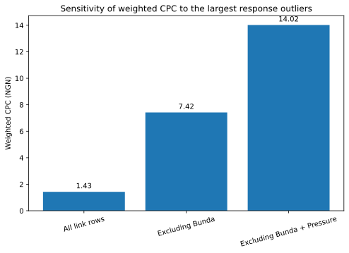
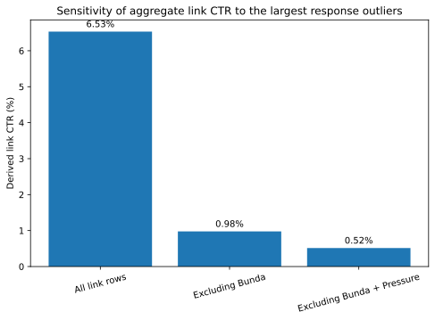

# Kashe Music Group / Santeri: Retrospective Campaign Performance Analysis

A reproducible portfolio case study connecting my earlier music-campaign work with the data, research and information-quality discipline developed through my later IT and MSc study.

## Start here

- **[CEO dashboard](dashboard.py)** - a one-screen decision brief that leads with the concentration finding, sensitivity and next action.
- **[Portfolio brief](PORTFOLIO_BRIEF.md)** - the two-minute account of what I did, what the surviving data shows, and how I would design the next creative test.
- **[Exploratory report](reports/exploratory_findings.md)** - the fuller analysis, literature and historical context.
- **[Methodology](METHODOLOGY.md)** - evidence categories, preparation decisions and analytical rules.
- **[Technical audit](TECHNICAL_AUDIT.md)** - code, testing, provenance and reproducibility assessment.

## Thirty-second view

### What I did then

At Kashe Music Group I coordinated creative production and release activity, worked with distributed contributors and creators, managed parts of paid and organic promotion, and used campaign response to guide practical decisions. During the paid-growth phase, I grew the Facebook page audience from launch to around 5,000 in just over a month before it plateaued. I also used click-to-WhatsApp campaigns to build a direct audience contact list for closer engagement, and the Bunda music video reached 230,000+ YouTube views during its active release period. These three outcomes are part of my historical account; the surviving Meta export partly corroborates the Facebook and messaging activity but does not independently record the full Facebook timeline, YouTube total or later use of contacts.

The work pre-dated my formal data training, and the historical tracking was not designed for a later creative-effectiveness study.

### What I can verify now

The surviving Meta export contains **126 campaign rows**, **NGN 1,029,228.11 spend** and **10,332,896 impressions**. Across 106 comparable link-click rows, it records **635,240 clicks**, a portfolio-weighted **NGN 1.43 CPC** and a derived **6.53% CTR**.

The unit of observation is an exported campaign row, not a unique ad creative. Link-click campaigns account for 106 of the 126 rows, so the quantitative findings are primarily a traffic-response retrospective; the smaller result-type groups are reported descriptively rather than treated as equally developed comparisons.

Those pooled figures are not typical campaign performance. Two Bunda YouTube traffic rows and one Pressure row produced **94.32% of link clicks** from **44.27% of link-campaign spend** and **28.00% of link-campaign impressions**. Removing those rows increases weighted CPC from **NGN 1.43** to **NGN 14.02** and reduces derived CTR from **6.53%** to **0.52%**.

### What the evidence does not show

The export does not consistently preserve ad-level IDs, creative assets, hook, format, angle, creator, audience, placement or downstream sales and revenue. It can show **where recorded response differed**, but it cannot identify which creative feature caused the difference or establish total campaign return.

### What I would do next

I would define the decision and primary business outcome before launch, apply a stable creative taxonomy, preserve campaign/ad IDs and delivery settings, link platform response to downstream outcomes, and use controlled comparisons where causal attribution matters. The proposed design is set out in the **[portfolio brief](PORTFOLIO_BRIEF.md#proposed-next-campaign-design)**. It is a forward-looking method, not a claim that the historical campaign used that design.

## Evidence and provenance

The original workbook is not public because a campaign name contains a historical WhatsApp phone number. The pipeline verifies the restricted workbook hash, redacts that number and produces the committed public derivative. Every source row is retained. Four rows with blank result fields are flagged rather than imputed, and unlike result types are not combined into one performance total.

The workbook is a partial export: a separate account screenshot records higher lifetime spend than the workbook. Production cost, team size, chronology and other historical outcomes that do not appear in the workbook are labelled as author-reported context in the full report and provenance record.

See **[PROVENANCE.md](PROVENANCE.md)** and **[DATA_USE.md](DATA_USE.md)** for the evidence boundary.

## Reproducible workflow

1. `scripts/xlsx_reader.py` reads the known historical XLSX structure.
2. `scripts/prepare_data.py` performs targeted preparation, verification and redaction.
3. `scripts/validate_data.py` checks schema, ranges, privacy and exported cost-per-result arithmetic.
4. `scripts/analyse_campaigns.py` calculates the published KPIs, distributions, concentration and sensitivity results.
5. `scripts/visualise_results.py` generates five canonical SVG figures.
6. `scripts/build_manifest.py` records complete code/product hashes and runtime versions.
7. `scripts/run_pipeline.py` runs the workflow in order.

The workflow is deliberately proportionate to one historical export. It is not presented as a production advertising platform or as comprehensive data cleaning.

## Repository guide

- **[Sanitised campaign data](data/meta_campaign_export_sanitized.csv)** - generated public derivative of the restricted workbook.
- **[Analysis summary](analysis/summary.json)** - machine-readable KPI outputs.
- **[Validation report](analysis/validation_report.json)** - automated data checks.
- **[Pipeline guide](PIPELINE.md)** - execution stages and commands.
- **[Run manifest](analysis/run_manifest.json)** - runtime and SHA-256 provenance.











## Run the pipeline

With the verified private workbook at `data/private/30-01-23.xlsx`:

```bash
python -m scripts.run_pipeline
```

To rebuild public products without the private workbook:

```bash
python -m scripts.run_pipeline --from-public-csv
```

Launch the executive dashboard:

```bash
streamlit run dashboard.py
```

The dashboard design and source decisions are recorded in
**[CEO dashboard research](docs/CEO_DASHBOARD_RESEARCH.md)**.

Tests and code-quality checks:

```bash
python -m unittest discover -s tests -v
ruff check scripts tests
```

## AI assistance and author responsibility

The advertising, release activity and source data relate to work I personally carried out; ChatGPT did not participate in the historical campaigns. I reviewed the source material, preparation decisions, calculations and interpretation.

ChatGPT was later used to assist with Python development, calculation checks, literature discovery and drafting. Its output was not treated as evidence. Source-recorded metrics, derived calculations, author-reported context and external research are distinguished throughout, and I retain responsibility for the published analysis.
